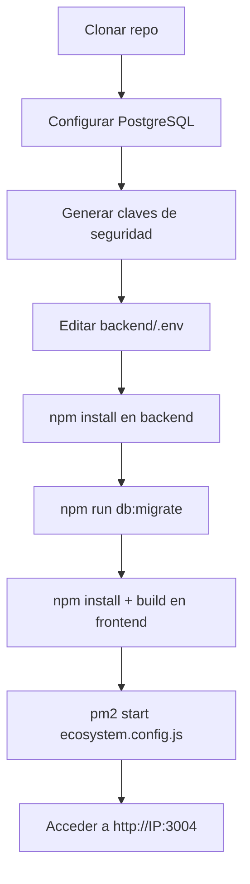

# ✅ Cambios para Despliegue Integrado - Puerto 3004

## 🎯 Objetivo Cumplido

Backend y frontend integrados en un solo servicio PM2 corriendo en puerto 3004.

---

## 📝 Archivos Modificados

### 1. **backend/src/index.js**
- ✅ Agregado servidor de archivos estáticos para el frontend
- ✅ Ruta catch-all para SPA routing (React Router)
- ✅ Solo activo cuando `NODE_ENV=production`
- ✅ Frontend servido desde `../frontend/dist/`

### 2. **.gitignore**
- ✅ Actualizado para permitir `.env.production` en el repo (son templates)
- ✅ Bloquea `.env` y `.env.local` (archivos con credenciales reales)

---

## 📁 Archivos Nuevos Creados

### 1. **ecosystem.config.js** (raíz)
```javascript
// Configuración PM2 unificada
// Puerto: 3004
// Script: backend/src/index.js
// Nombre: burgerpos
```

**Comando:**
```bash
pm2 start ecosystem.config.js --env production
```

### 2. **backend/.env.production** (TEMPLATE)
- ✅ Puerto configurado: 3004
- ✅ Variables para base de datos
- ⚠️ Claves de seguridad con placeholders (GENERAR en producción)
- ⚠️ URLs configuradas para vps-5839248-x.dattaweb.com

**⚠️ IMPORTANTE:** En el servidor, copiar a `.env` y completar:
- `DB_PASSWORD`: Password real de PostgreSQL
- `JWT_SECRET`: Generar con crypto.randomBytes(64)
- `ENCRYPTION_KEY`: Generar con crypto.randomBytes(32)
- `SESSION_SECRET`: Generar con crypto.randomBytes(32)

### 3. **frontend/.env.production** (TEMPLATE)
- ✅ `VITE_API_URL`: http://vps-5839248-x.dattaweb.com:3004/api
- ✅ `VITE_WS_URL`: http://vps-5839248-x.dattaweb.com:3004

**En el servidor:** Ajustar si tu dominio/IP es diferente.

### 4. **DEPLOY_GUIDE.md**
- ✅ Guía paso a paso completa
- ✅ Desde crear DB hasta acceder desde el navegador
- ✅ Incluye troubleshooting común
- ✅ Comandos de mantenimiento

---

## 🚀 Flujo de Despliegue



---

## 🔑 Pasos Críticos en el Servidor

1. **Copiar template a archivo real:**
   ```bash
   cd /burgerpos/backend
   cp .env.production .env
   ```

2. **Generar claves:**
   ```bash
   node -e "console.log(require('crypto').randomBytes(64).toString('hex'))"
   node -e "console.log(require('crypto').randomBytes(32).toString('hex'))"
   node -e "console.log(require('crypto').randomBytes(32).toString('hex'))"
   ```

3. **Editar `.env` con las claves generadas:**
   ```bash
   nano .env
   ```

4. **Build frontend:**
   ```bash
   cd /burgerpos/frontend
   npm install
   npm run build
   ```

5. **Iniciar con PM2:**
   ```bash
   cd /burgerpos
   pm2 start ecosystem.config.js --env production
   ```

---

## ✅ Verificaciones

### Backend funcionando:
```bash
curl http://localhost:3004/api/health
# Esperado: {"status":"ok"}
```

### Frontend siendo servido:
```bash
curl -I http://localhost:3004/
# Esperado: 200 OK, Content-Type: text/html
```

### Logs sin errores:
```bash
pm2 logs burgerpos --lines 50
# Buscar: "✅ PostgreSQL conectado" y "🚀 Servidor en puerto 3004"
```

---

## 🌐 Acceso

Después del despliegue, acceder desde:

- **Servidor local:** http://localhost:3004
- **Red local/externa:** http://66.97.35.172:3004
- **Con dominio:** http://vps-5839248-x.dattaweb.com:3004

Login inicial:
- Email: `admin@burgerpos.com`
- Password: `AdminBurger2026!` (crear en Paso 12 de DEPLOY_GUIDE.md)

---

## 📦 Archivos para Subir a GitHub

Estos archivos YA están listos para commit y push:

✅ `backend/src/index.js` (modificado)
✅ `backend/.env.production` (nuevo - TEMPLATE)
✅ `frontend/.env.production` (nuevo - TEMPLATE)
✅ `ecosystem.config.js` (nuevo)
✅ `DEPLOY_GUIDE.md` (nuevo)
✅ `.gitignore` (modificado)
✅ `RESUMEN_CAMBIOS.md` (este archivo)

**❌ NO se suben:**
- `backend/.env` (archivo real con credenciales)
- `backend/node_modules/`
- `frontend/node_modules/`
- `frontend/dist/`

---

## 🔄 Próximos Pasos

1. **Commit de cambios:**
   ```bash
   git add .
   git commit -m "feat: Configuración integrada para despliegue en puerto 3004"
   git push origin main
   ```

2. **En el servidor VNC:**
   ```bash
   cd /burgerpos
   git pull origin main
   ```

3. **Seguir DEPLOY_GUIDE.md paso a paso**

---

## 💡 Ventajas de Esta Configuración

✅ **Un solo proceso PM2**: Backend sirve frontend automáticamente  
✅ **Un solo puerto**: 3004 para todo  
✅ **No necesita Nginx/Apache**: Simplifica despliegue inicial  
✅ **Fácil mantenimiento**: `pm2 restart burgerpos` reinicia todo  
✅ **Templates versionados**: `.env.production` en el repo como referencia  
✅ **Seguro**: Archivos `.env` reales no se suben a GitHub  

---

## ⚙️ Comandos Rápidos

```bash
# Ver estado
pm2 status

# Ver logs
pm2 logs burgerpos

# Reiniciar
pm2 restart burgerpos

# Actualizar código
cd /burgerpos && git pull && cd backend && npm install && cd ../frontend && npm run build && cd .. && pm2 restart burgerpos

# Backup DB
pg_dump -h localhost -U burgerpos_user burgerpos_prod | gzip > backup_$(date +%Y%m%d).sql.gz
```

---

## 📞 Soporte

Ver archivo completo: **DEPLOY_GUIDE.md**
